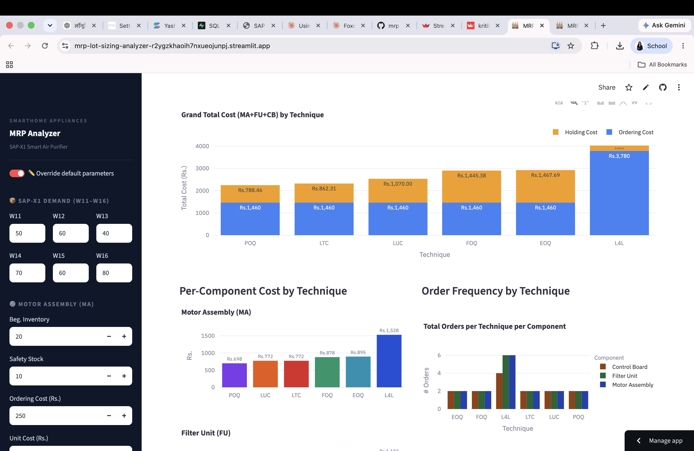
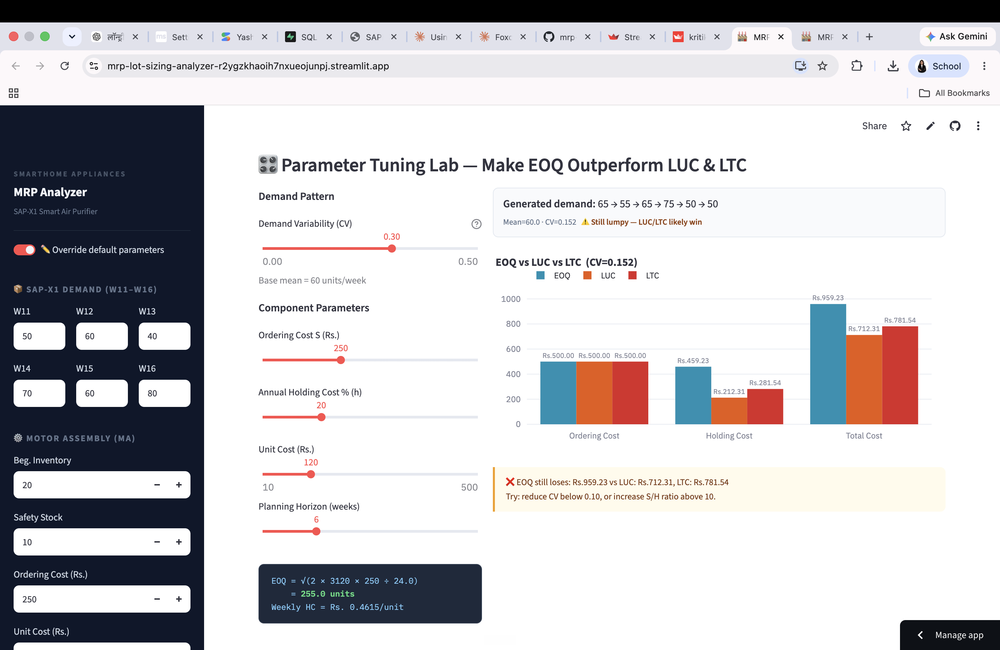

# MRP Lot Sizing Analyzer

**An interactive dashboard that runs all six classical lot sizing techniques on a multi-level bill of materials, compares their total cost side by side, and lets you explore live when each technique wins.**

🔗 **[Live App](https://mrp-lot-sizing-analyzer-r2ygzkhaoih7nxueojunpj.streamlit.app)** · No login needed



> Course case study built from the SmartHome Appliances SAP-X1 Smart Air Purifier assignment for the Operations & Supply Chain Management course at FORE School of Management. Company and product names are fictional; the case data is standard textbook input.

---

## The problem

A production planner has to decide, week by week, *how much* to order of each component and *when* to place the order. Order too often and setup costs pile up. Order too much and inventory sits in the warehouse burning holding cost. Six textbook techniques exist to solve this — L4L, EOQ, FOQ, POQ, LUC, LTC — and each one wins under different demand patterns, cost ratios, and horizons. In a classroom the trade-off is worked out with pen-and-paper MRP tables; in practice, planners want to see the answer for their own numbers, and see it change as parameters move.

**User:** operations planners and students learning MRP.
**Job to be done:** pick the lowest-cost ordering plan for the whole bill of materials, and understand *why* it's cheapest.
**What "good" looks like:** side-by-side cost comparison, editable inputs, and a clear breakeven view for the technique choice.

---

## What it does

| Tab | Purpose |
|---|---|
| **MRP Tables** | Full 8-week MRP tables (W8–W15) for all six techniques across Motor Assembly, Filter Unit, and Control Board. Live formula boxes for EOQ, FOQ, and POQ. |
| **Cost Analysis** | Grand-total and per-component cost charts, order frequency, average inventory, and a colour-graded pivot ranking all six techniques from cheapest to most expensive. |
| **EOQ Outperformance Lab** | Interactive sliders for demand variability (CV), ordering cost, holding %, unit cost, and horizon. A live verdict shows whether EOQ beats LUC and LTC under the chosen parameters, plus an automatic breakeven sweep from CV = 0 to 0.40. |
| **Level 2 Sub-Components** | Cascades the parent's planned order releases into Level-2 MRP for the four sub-components (Rotor Unit, Housing, Filter Media, Plastic Frame), showing how the Level-1 choice ripples down the BOM. |

Every table and chart recomputes live when you toggle **Override default parameters** in the sidebar.



---

## Bill of materials

```
SAP-X1  (Level 0 — Final Product)
    ├── Motor Assembly (MA)  ×1   [LT=1wk, BI=20, SS=10, SR=30 in W12]
    │       ├── Rotor Unit (RU)   ×2  [LT=1wk, BI=0, SS=0]
    │       └── Housing (HS)      ×1  [LT=1wk, BI=0, SS=0]
    ├── Filter Unit (FU)     ×2   [LT=2wk, BI=40, SS=20]
    │       ├── Filter Media (FM)   ×1  [LT=1wk, BI=0, SS=0]
    │       └── Plastic Frame (PF)  ×1  [LT=1wk, BI=0, SS=0]
    └── Control Board (CB)   ×1   [LT=1wk, BI=25, SS=0, MOQ=100]
```

---

## Results

Grand total cost (MA + FU + CB) over the 6-week horizon, on default inputs:

| Rank | Technique | Total cost (Rs.) | Why |
|---|---|---|---|
| 🥇 | **POQ** | **2,248.46** | 4-week order interval aligns with the demand rhythm |
| 🥈 | LTC | 2,322.31 | Groups periods so cumulative holding cost ≈ one setup |
| 🥉 | LUC | 2,530.00 | Extends the cycle while unit cost keeps falling |
| 4 | FOQ | 2,905.38 | Fixed batch; not tuned to lumpy demand |
| 5 | EOQ | 2,927.69 | Assumes steady demand — case demand is CV ≈ 0.24, lumpy |
| 6 | L4L | 4,024.62 | Six separate ordering events × three components |

**POQ saves ≈ 44% vs. L4L on this case.** L4L is the worst because it treats every period as its own order; POQ wins because a 4-week cycle happens to line up with the lumpy demand pattern, absorbing several periods into each order.

### The EOQ question (Tab 3)

EOQ *does not* win on the SAP-X1 case, because textbook EOQ assumes near-uniform demand and this case is lumpy (CV ≈ 0.24). The lab lets you drop the CV using a slider and watch EOQ's cost fall past LUC and LTC. Breakeven sits around **CV ≤ 0.06** — below that, EOQ starts winning. This maps to the real-world pattern that EOQ is used in FMCG staples, pharma APIs, and standardised industrial parts, where demand is close to constant.

---

## Product decisions and trade-offs

| Decision | Why | Trade-off accepted |
|---|---|---|
| **All parameters editable in the sidebar** | The interesting question isn't the default answer; it's what happens when the planner changes their assumptions. | Bigger sidebar, more state to manage |
| **Show all six techniques together, not one at a time** | Comparison is the point — hiding the losers behind a dropdown obscures the trade-off. | Longer scroll, four tabs instead of one dense screen |
| **Recompute live rather than pre-render** | Sliders are what make the EOQ lab click; a static chart wouldn't have taught the CV = 0.06 breakeven. | Cost pattern re-runs on every slider move |
| **Included Level-2 explosion** | A recruiter or classmate can see whether I understood that lot sizing at Level 1 changes Level-2 workload, not just Level-1 cost. | Extra tab; extra 200 lines of code |
| **Kept the industry-scenarios panel** | Grounds the abstract question ("when does EOQ win?") in businesses people know. | CV values are indicative estimates from published patterns, not measured industry data — flagged as such in the app. |
| **Streamlit + Plotly, single-file app** | Zero cost to host, reproducible from one file. | Not the layout flexibility of a full framework; some CSS injected inline |

---

## Limitations and what I'd build next

1. **Case fixed at three Level-1 components.** Adding an "upload your own BOM" input would make the tool usable for anyone's own product, not just SAP-X1.
2. **Cost model is single-period cost, not full lifecycle.** Purchase discounts, capacity constraints, and stockout costs aren't modelled.
3. **No stochastic demand.** The lab varies the CV but demand is generated once per slider move, not sampled — a Monte Carlo mode would show cost distributions instead of point estimates.
4. **Level-2 assumes L4L.** In reality sub-components have their own EOQ / MOQ constraints; adding a technique selector at Level 2 would let the ripple effect be compared under different parent policies.
5. **Save and share a scenario.** A "copy shareable link" button that encodes slider state in the URL would help planners hand a scenario to a colleague.

---

## Tech stack

Python · Streamlit · Pandas · NumPy · Plotly · Streamlit Community Cloud

## Run locally

```bash
git clone https://github.com/kritikab01/mrp-lot-sizing-analyzer.git
cd mrp-lot-sizing-analyzer
pip install -r requirements.txt
streamlit run app.py
```

Opens at `http://localhost:8501`. No API keys or secrets required.

## Project structure

```
app.py                          # MRP engine, six techniques, and the Streamlit UI (single file)
requirements.txt                # streamlit, pandas, numpy, plotly
docs/screenshot-cost-analysis.png
docs/screenshot-eoq-lab.png
```

---

## MRP formulas reference

```
Gross Requirements (GR)         = Given demand / Parent POREL × usage qty
Scheduled Receipts (SR)         = Pre-placed open orders
Projected On-Hand (POH)         = POH(t-1) + SR(t) + POR(t) − GR(t)
Net Requirements (NR)           = max(0, GR(t) − POH(t-1) − SR(t) + SS)
Planned Order Receipts (POR)    = Lot sizing rule applied to NR
Planned Order Releases (POREL)  = POR shifted back by Lead Time periods

EOQ  = √(2 × D_annual × S / H_annual)
FOQ  = round(EOQ to nearest 10)      [CB: further rounded up to nearest 100 MOQ]
POQ  = round(EOQ ÷ avg weekly demand) weeks per cycle
LUC  = Stop extending the cycle when (S + ΣHC) / ΣQty starts rising
LTC  = Stop extending the cycle when |ΣHC − S| is minimised
```

---

## My role

Individual project for the **Operations & Supply Chain Management** course at FORE School of Management. I built the full application end-to-end — the MRP engine for all six techniques, the multi-level BOM cascade, the interactive parameter override, the EOQ outperformance lab with its live breakeven sweep, and the Streamlit interface.

**Kritika Bhachawat** · [LinkedIn](https://www.linkedin.com/in/kritika-bhachawat-jain-4740ba194/) · [Portfolio](https://kritikabhachawat.me/)
